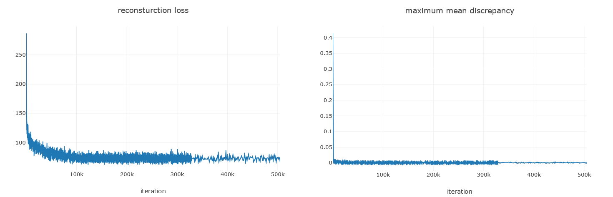
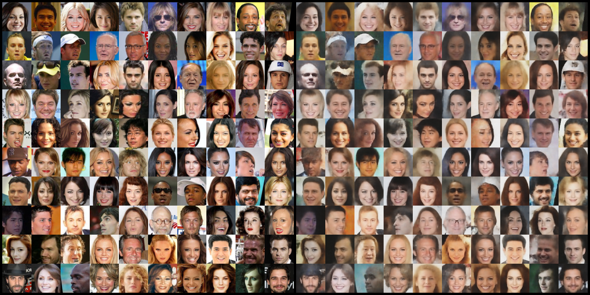
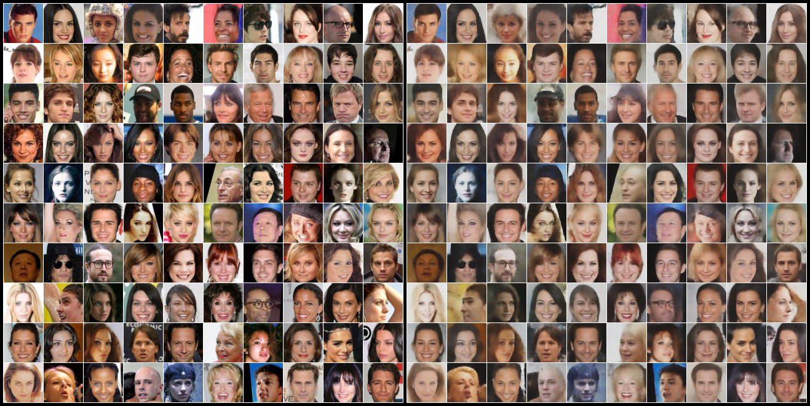

# WAE-pytorch
Pytorch implementation of WAE-MMD([paper]).

### Dependencies
```
python 3.6.4
pytorch 0.3.1.post2
visdom
```
<br>

### Usage
1. download ```img_align_celeba.zip``` and ```list_eval_partition.txt``` files from [here], make ```data``` directory, put downloaded files into ```data```, and then run ```./preprocess_celeba.sh```. for example,
```
.
└── data
  └── img_align_celeba.zip
  └── list_eval_partition.txt
```
2. initialize visdom
```
python -m visdom.server
```
3. run by scripts
```
sh run_celeba_wae_mmd.sh
```
4. check training process on the visdom server
```
localhost:8097
```
<br>

## Results - CelebA
### training plots

### train data reconstruction

### test data reconstruction

### random data generation via sampling z from P(z)
<p align="center">

</p>

## References
1. Wasserstein Auto-Encoders, Tolstikhin et al, ICLR, 2018
2. Code repos : [official], [re-implemetation], both in Tensorflow

[here]: http://mmlab.ie.cuhk.edu.hk/projects/CelebA.html
[paper]: https://arxiv.org/abs/1711.01558
[official]: https://github.com/tolstikhin/wae
[re-implementation]: https://github.com/hiwonjoon/wae-wgan
